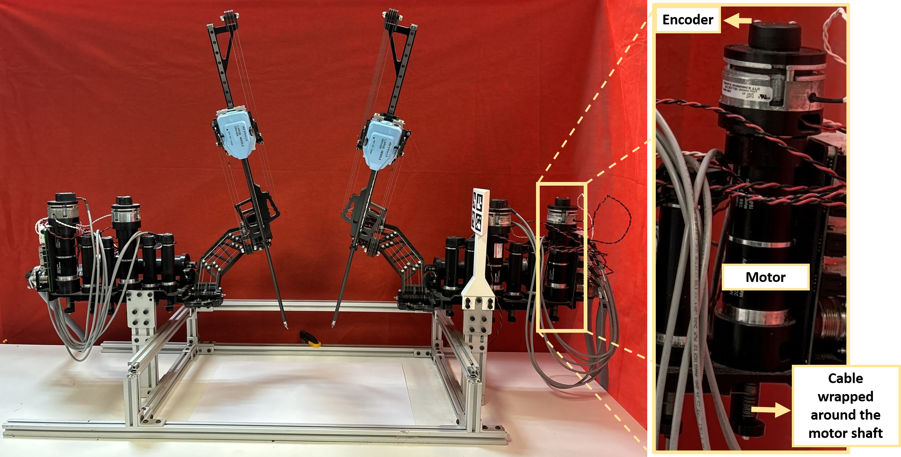

Here is the Sorce code for the article "Bias-Aware AI-aided Kalman Tracking for Accurate Tool Localization in Cable-Driven Surgical Robots".
# KalmanNet_for_surgical_robots - 2

## Running the code

  `python3 Main_KalmanNet_Raven.py`

  
## Parameters Settings

**Planar robot case:**
- Simulations/parameters_withbias_trainIK.py

  Contains model settings: m, n, f, h, Q.
  
  
- Simulations/config.py
  
  Contain training parameters and network settings.
  
- main file
  
  Set flags, paths, etc..

